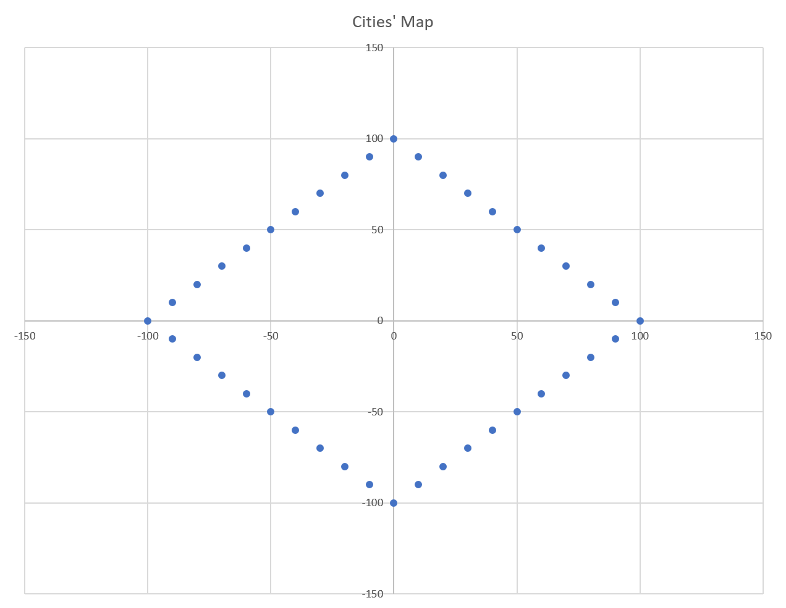

# Travelling Salesman Problem
Implementation of a Genetic Algorithm using Clojure. See the literate programming page: [Docs](https://vascoferreira25.github.io/travelling-salesman-problem/index.html)

> "Given a list of cities and the distances between each pair of cities, what
> is the shortest possible route that visits each city and returns to the
> origin city?"
- [Wikipedia](https://en.wikipedia.org/wiki/Travelling_salesman_problem)

This implementations uses a genetic algorithm to find the shortest route
between cities.

## Installation

1. Clone this repo:
```shell
git clone https://github.com/vascoferreira25/travelling_salesman_problem_rust
```

## Purpose

Find the best possible route for a list of cities.
The cities are represented in the following chart:



## Results

### Evolution

### Solution


## License

Copyright © 2019

This program and the accompanying materials are made available under the
terms of the Eclipse Public License 2.0 which is available at
http://www.eclipse.org/legal/epl-2.0.

This Source Code may also be made available under the following Secondary
Licenses when the conditions for such availability set forth in the Eclipse
Public License, v. 2.0 are satisfied: GNU General Public License as published by
the Free Software Foundation, either version 2 of the License, or (at your
option) any later version, with the GNU Classpath Exception which is available
at https://www.gnu.org/software/classpath/license.html.
